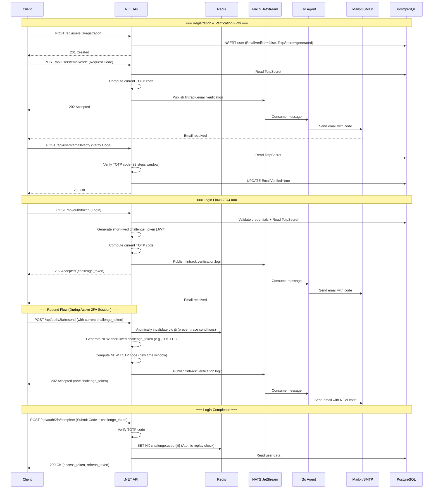

# 2FA Architecture & Design Document for FinTrack API

## Overview
This document describes the architecture for implementing Two-Factor Authentication (TOTP via email) for the registration and login flows in the FinTrack API. Email delivery is delegated to a separate Go microservice, with asynchronous communication handled via NATS JetStream.

---

## Architecture & Data Flow Diagram



### Login Completion — Response Contract

Upon successful TOTP verification via `POST /api/auth/2fa/complete`, the API returns the **standard Access and Refresh token pair**, exactly as defined in the [Access & Refresh Token Implementation Plan](access-refresh-tokens-docs.md).

**Response example (`200 OK`):**
```json
{
  "access_token": "eyJ...",
  "refresh_token": "opaque_base64url_string...",
  "token_type": "Bearer",
  "expires_in": 900
}
```

---

## Technology Decisions

| Decision      | Choice                      | Rationale                                                                                                    |
| ------------------------- | --------------------------- | ------------------------------------------------------------------------------------------------------------ |
| Message Broker            | **NATS JetStream**          | Lightweight, persistent, *at-least-once* delivery guarantee (Workqueue retention), ideal for microservices.  |
| Email (Dev Environment)   | **Mailpit**                 | Catches all outgoing emails, provides a web UI, fully autonomous in `docker-compose`.                        |                                   |
| 2FA Algorithm             | **TOTP (RFC 6238)**         | Industry standard. Does not require storing one-time codes in the database; codes are computed on the fly.   |
| TOTP Secret Storage       | **PostgreSQL (User table)** | Persistent storage in a `VARCHAR(64)` column (Base32 encoded).                                               |
| Challenge Token           | **Short-lived JWT**         | Short TTL, contains `userId`, `jti`, and a `token_type: 2fa_pending` claim.                               |   

---

## Key Architectural Decisions & Security Rules

| Decision | Implementation Details |
| :--- | :--- |
| **TOTP Window** | **±2 steps (60 seconds)** – optimal balance between user convenience and security. |
| **Replay Protection** | Atomic `SET NX` in Redis for the challenge token's `jti`. Executed **strictly after** successful TOTP validation, allowing users to correct typos without locking the session. |
| **Login Resend Logic** | Upon resend request, the old `jti` is forcibly invalidated in Redis, and the client is issued a **new** `challenge_token` with a very short TTL (e.g., 90 seconds). |
| **Rate Limiting** | **Mandatory** on `/2fa/complete` and `/email/verify` endpoints (e.g., 5 attempts per 15 minutes per user). This safely allows typo corrections while blocking brute-force attacks. |
| **Code Generation Scope** | Occurs **exclusively in the .NET API**. The Go agent receives a message containing only `UserId`, `Email`, and the ready-to-use 6-digit `TotpCode`. |
| **Access Management** | Utilizes the `amr` (Authentication Method Reference) claim: `pwd` for basic authentication, `mfa` for fully verified sessions. Sensitive endpoints enforce a `VerifiedEmail` policy requiring `amr="mfa"`. |