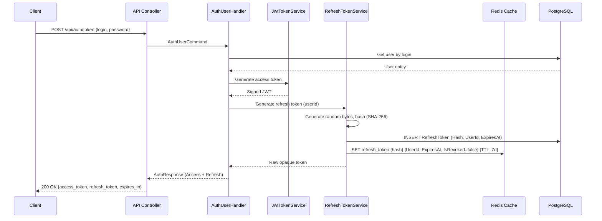
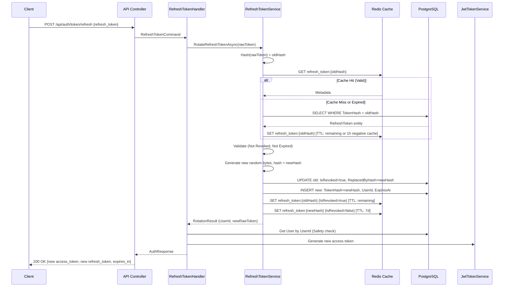
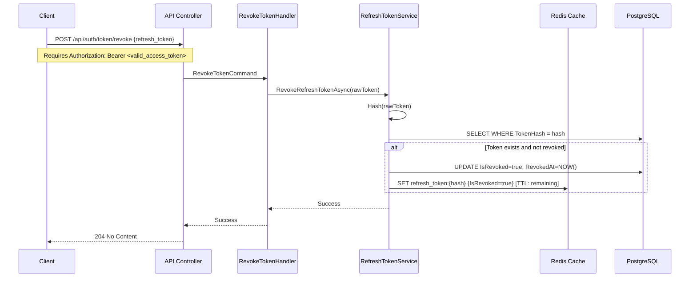

# Architectural Plan: Access & Refresh Token Implementation

## 1. Overview
- **Access Token**: JWT, short-lived (15 minutes).
- **Refresh Token**: Opaque, long-lived (7 days), with mandatory rotation on every use.

## 2. Key Architectural Decisions

| Decision | Choice | Rationale |
| :--- | :--- | :--- |
| **Refresh Token Format** | Opaque (Base64Url), 32 bytes of cryptographically secure randomness | Prevents forgery or data extraction by the client or in case of a leak. |
| **Database Storage** | Only the SHA-256 hash of the token | Protects against DB compromise; attackers will not obtain the actual raw tokens. |
| **Cache Storage (Redis)** | Primary store for validation + PostgreSQL as fallback | Ensures fast-fail validation and offloads read traffic from the database. |
| **Revoke Handling** | **Tombstone Pattern (Negative Caching)** | Upon revocation, the Redis key is *not* deleted, but updated with `IsRevoked=true` and a TTL equal to the token's remaining lifetime. This prevents Cache Penetration (DDoS on the DB with old tokens). |
| **Rotation Strategy** | Simple Rotation | The old token is immediately invalidated upon a successful refresh request. |
| **Revoke Endpoint** | Requires a valid Access Token in the header | Prevents malicious revocation by an attacker who intercepted only the Refresh Token. |

---

## 3. Architecture Diagrams

### 3.1. Login / Token Issuance

> **Note on 2FA Integration:** 
> If the user has Two-Factor Authentication (2FA) enabled, this endpoint behaves differently. 
> Instead of returning the final token pair, it validates credentials, generates a short-lived `challenge_token` (JWT), and returns `202 Accepted`. 
> The actual `access_token` and `refresh_token` described in this diagram are issued only after successful 2FA code verification via `POST /api/auth/2fa/complete`. 
> This diagram represents the final token issuance step (or the flow for users without 2FA).

### 3.2. Refresh (Rotation)

### 3.3. Revoke (Logout)
