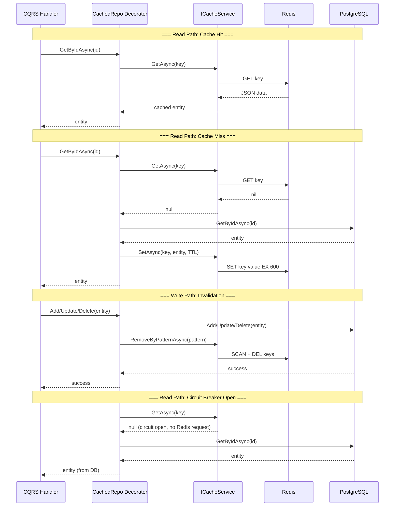

# Redis Caching Architecture (FinTrack API)

## Overview
This document describes the strategy for integrating Redis as a caching service. The implementation is based on the **Decorator** pattern applied over repositories, ensuring caching remains transparent to the business logic. It utilizes a hybrid invalidation strategy (targeted removal + TTL) and a Circuit Breaker for fault tolerance.

---

## Key Architectural Decisions

| Parameter | Chosen Solution |
| :--- | :--- |
| **Invalidation Strategy** | **Hybrid**: targeted key removal for entities + pattern flushing for lists + 10-minute TTL fallback |
| **Cached Entities** | **User** (all read operations), **Account** (all read operations), **Transaction** (only `GetById`) |
| **Redis Client** | `IDistributedCache` (basic operations) + `IConnectionMultiplexer` (pattern/SCAN operations) |
| **Resilience** | **Polly Circuit Breaker**: 30s sampling / 15 min throughput / 40% failure ratio / 45s break duration |
| **Fallback Behavior** | Fail-open: if Redis is unavailable, the cache is bypassed and requests go directly to the DB |
| **Serialization** | JSON (`System.Text.Json`, camelCase) |
| **Integration Pattern** | **Decorator** (Scrutor `Decorate<>`) |

---

## Interaction Flow (Sequence Diagram)

---

## Cache Key Dictionary and Invalidation Strategy

### 1. User
| Operation | Cache Key / Pattern | Write Action (Add/Update/Delete) |
| :--- | :--- | :--- |
| `GetById` | `user:{id}` | `RemoveAsync("user:{id}")` |
| `GetByEmail` | `useremail:{email}` | `RemoveAsync("user:email:{old_email}")` |
| `GetAll` (lists) | `users:all:{page}:{size}` | `RemoveByPatternAsync("users:all:*")` |

*Note:* When updating a user, their current `email` must be loaded from the DB *before* the update to correctly invalidate the old `user:email:{old_email}` key.

### 2. Account
| Operation | Cache Key / Pattern | Write Action (Add/Update/Delete) |
| :--- | :--- | :--- |
| `GetById` | `account:{id}` | `RemoveAsync("account:{id}")` |
| `GetAll` (lists) | `accounts:all:{page}:{size}` | `RemoveByPatternAsync("accounts:all:*")` |
| `GetByUserId` | `accounts:user:{userId}` | `RemoveByPatternAsync("accounts:user:*")` |

### 3. Transaction
| Operation | Cache Key / Pattern | Write Action |
| :--- | :--- | :--- |
| `GetById` | `transaction:{id}` | *Not required* (transactions are neither updated nor deleted) |
| Other reads | *Not cached* | Direct delegation to DB |

---

## Resilience Strategy (Circuit Breaker)

To prevent cascading failures during Redis outages, a Circuit Breaker (Polly) is applied to all cache service operations:
- **Sampling Duration**: 30 seconds (statistics collection window).
- **Minimum Throughput**: 15 requests (minimum request count for evaluation).
- **Failure Ratio**: 40% (error threshold to trigger the break).
- **Break Duration**: 45 seconds (time during which the cache is bypassed and requests go directly to the DB).

---

