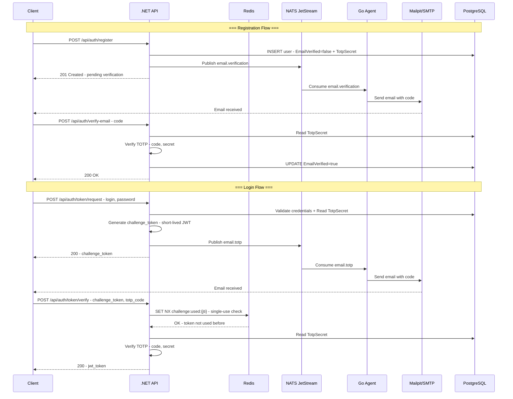

# 2FA Implementation Plan for FinTrack API

## Overview

Добавление двухфакторной аутентификации (TOTP через email) для регистрации и логина. Отправка email вынесена в отдельный Go-микросервис, коммуникация через NATS JetStream.

---

## Architecture Diagram



---

## Prerequisites

**Redis** должен быть развёрнут и доступен перед началом реализации 2FA. План развёртывания Redis: [`redis-cache-implementation-plan.md`](plans/redis-cache-implementation-plan.md).

## Technology Decisions

| Decision              | Choice                      | Rationale                                                                                                    |
| --------------------- | --------------------------- | ------------------------------------------------------------------------------------------------------------ |
| Message Broker        | **NATS JetStream**          | Лёгкий (один бинарник ~20MB), persistence через JetStream, at-least-once delivery, идеален для микросервисов |
| Email (dev)           | **Mailpit**                 | Ловит все письма, веб-интерфейс на :8025, полностью автономен в docker-compose                               |
| Email (prod)          | **SMTP-релей**              | Конфигурируется через env vars (SendGrid/Mailgun/etc.)                                                       |
| 2FA Algorithm         | **TOTP (RFC 6238)**         | Индустриальный стандарт, не требует хранения кодов в БД                                                      |
| TOTP Secret Storage   | **PostgreSQL (User table)** | Персистентное хранение. Опционально кэшируется в Redis для ускорения верификации                             |
| Challenge Token       | **Short-lived JWT**         | 5 минут TTL, подписан тем же Vault-ключом, содержит userId                                                   |
| Challenge Token Track | **Redis `SET NX` + TTL**    | Single-use отслеживание через атомарный `StringSetAsync` с `NX` и TTL=5min. Переживает рестарты API          |

---

## Phase 1: Infrastructure

> **Note:** Redis уже развёрнут согласно [`redis-cache-implementation-plan.md`](plans/redis-cache-implementation-plan.md). В этой фазе добавляются только NATS и Mailpit.

### 1.1 NATS JetStream in docker-compose

```yaml
nats:
  image: nats:2.11-alpine
  command: "-js -m 8222"
  ports:
    - "4222:4222" # client port
    - "8222:8222" # monitoring
  volumes:
    - nats-data:/data
  networks:
    - api-network
  healthcheck:
    test: ["CMD", "nats", "server", "check", "-s", "nats://localhost:4222"]
    interval: 10s
    timeout: 3s
    retries: 3
```

### 1.2 Mailpit in docker-compose

```yaml
mailpit:
  image: axllent/mailpit:latest
  ports:
    - "1025:1025" # SMTP
    - "8025:8025" # Web UI
  volumes:
    - mailpit-data:/data
  networks:
    - api-network
```

### 1.3 New volumes & networks

- Volume: `nats-data`, `mailpit-data`
- Go agent joins `api-network`

---

## Phase 2: Database Changes

### 2.1 User Entity (`FinTrack.API.Core/Entities/User.cs`)

New fields:

```csharp
public bool EmailVerified { get; private set; }
public string? TotpSecret { get; private set; }  // Base32-encoded

public void SetTotpSecret(string secret) => TotpSecret = secret;
public void VerifyEmail() => EmailVerified = true;
```

### 2.2 UserDb (`FinTrack.API.Infrastructure/Data/DbEntities/UserDb.cs`)

```csharp
public bool EmailVerified { get; set; }
public string? TotpSecret { get; set; }
```

### 2.3 UserConfiguration

```csharp
builder.Property(t => t.EmailVerified).IsRequired().HasDefaultValue(false);
builder.Property(t => t.TotpSecret).HasMaxLength(64);
```

### 2.4 Migration

EF Core migration: `AddEmailVerificationAndTotp`

---

## Phase 3: TOTP Service (.NET)

### 3.1 Interface (`FinTrack.API.Core/Interfaces/ITotpService.cs`)

```csharp
public interface ITotpService
{
    string GenerateSecret();                          // 20-byte random → Base32
    string ComputeCode(string base32Secret);           // TOTP(secret, now)
    bool VerifyCode(string base32Secret, string code); // ±1 step window
}
```

### 3.2 Implementation (`FinTrack.API.Infrastructure/Identity/Services/TotpService.cs`)

- Uses `System.Security.Cryptography` for secret generation
- Implements RFC 6238: `TOTP = HOTP(K, T)`, where `T = (unix_time - T0) / X`
- Parameters: `T0=0`, `X=30s`, `digits=6`, `HMAC-SHA1`
- Verification window: current step ±2 (tolerates 60s clock skew)

### 3.3 DI Registration

In [`Program.cs`](FinTrack/FinTrack.API/Program.cs:138) `ConfigureServices`:

```csharp
services.AddSingleton<ITotpService, TotpService>();
```

---

## Phase 4: NATS Integration (.NET)

### 4.1 Message Contracts

```csharp
// FinTrack.API.Application/Common/Messages/
public record EmailVerificationMessage(Guid UserId, string Email, string TotpCode);
public record LoginTotpMessage(Guid UserId, string Email, string TotpCode);
```

### 4.2 NATS Publisher Interface

```csharp
// FinTrack.API.Core/Interfaces/IMessagePublisher.cs
public interface IMessagePublisher
{
    Task PublishAsync<T>(string subject, T message, CancellationToken ct);
}
```

### 4.3 NATS JetStream Publisher

```csharp
// FinTrack.API.Infrastructure/Messaging/NatsJetStreamPublisher.cs
```

- Uses `NATS.Net` NuGet package
- Connects to `nats://nats:4222`
- Creates JetStream streams on startup: `EMAIL_VERIFICATION`, `EMAIL_TOTP`
- Publishes with `PublishAsync` (fire-and-forget from API perspective)

### 4.4 DI Registration

```csharp
services.AddSingleton<IMessagePublisher, NatsJetStreamPublisher>();
// Or scoped if connection management requires it
```

---

## Phase 5: Registration Flow

### 5.1 Modified CreateUserHandler

Current flow in [`CreateUserHandler`](FinTrack/FinTrack.API.Application/UseCases/Users/Commands/CreateUser/CreateUserHandler.cs:27):

1. Hash password
2. Create User entity
3. Save to DB
4. Return UserId

**New flow:**

1. Hash password
2. Create User entity
3. Generate TOTP secret → `user.SetTotpSecret(secret)`
4. Save to DB (`EmailVerified = false` by default)
5. Compute TOTP code → `totpService.ComputeCode(secret)`
6. Publish `EmailVerificationMessage` to NATS
7. Return UserId with message "check email for verification code"

### 5.2 VerifyEmail Endpoint

**New Command:** `VerifyEmailCommand(Guid UserId, string Code)`

**New Handler:** `VerifyEmailHandler`

1. Load user by Id
2. If `EmailVerified` already → return error "already verified"
3. `totpService.VerifyCode(user.TotpSecret, code)`
4. If valid → `user.VerifyEmail()`, save
5. Return success

**New Endpoint:** `POST /api/auth/verify-email`

```json
{ "userId": "guid", "code": "123456" }
```

### 5.3 Login Gate

[`AuthUserHandler`](FinTrack/FinTrack.API.Application/UseCases/Users/Commands/AuthUser/AuthUserHandler.cs:19) should check `EmailVerified`:

- If `EmailVerified == false` → return error "email not verified"

---

## Phase 6: Login 2FA Flow

### 6.1 RequestTotp Endpoint

**New Command:** `RequestTotpCommand(string Login, string Password)`

**New Handler:** `RequestTotpHandler`

1. Validate credentials (reuse AuthUser logic)
2. If invalid → return 401
3. If `EmailVerified == false` → return error
4. Compute TOTP code from stored secret
5. Publish `LoginTotpMessage` to NATS
6. Generate challenge token (short-lived JWT, 5 min TTL, contains `userId` + `jti`)
7. Return `{ challenge_token }`

**New Endpoint:** `POST /api/auth/token/request`

```json
{ "login": "...", "password": "..." }
→ { "challenge_token": "..." }
```

### 6.2 VerifyTotp Endpoint

**New Command:** `VerifyTotpCommand(string ChallengeToken, string TotpCode)`

**New Handler:** `VerifyTotpHandler`

1. Validate challenge token (signature + expiry)
2. Extract userId from token
3. Load user, get TotpSecret
4. `totpService.VerifyCode(secret, code)`
5. If valid → generate real JWT (long-lived)
6. Return `{ token }`

**New Endpoint:** `POST /api/auth/token/verify`

```json
{ "challenge_token": "...", "totp_code": "123456" }
→ { "token": "eyJ..." }
```

### 6.3 Challenge Token Service

```csharp
// FinTrack.API.Infrastructure/Identity/Services/ChallengeTokenService.cs
public interface IChallengeTokenService
{
    string Generate(Guid userId);
    Guid Validate(string token); // throws if invalid/expired or already used
}
```

- Uses same JWT infrastructure (Vault signing)
- Short TTL: 5 minutes
- **Single-use**: `ChallengeTokenTracker` (in-memory `ConcurrentDictionary`) tracks used `jti` claims
- `Validate()` checks: signature → expiry → not previously used → marks as used

---

## Phase 7: Go Agent

### 7.1 Project Structure

```
fintrack-agent/
├── main.go
├── go.mod
├── go.sum
├── Dockerfile
├── internal/
│   ├── nats/
│   │   └── consumer.go      # NATS JetStream subscription
│   ├── email/
│   │   └── sender.go         # SMTP email sending
│   └── totp/
│       └── totp.go           # TOTP code generation (same RFC 6238)
└── config/
    └── config.go             # Env-based configuration
```

### 7.2 Dependencies

```
github.com/nats-io/nats.go
github.com/nats-io/nkeys
github.com/pquerna/otp        # TOTP implementation
gopkg.in/gomail.v2            # SMTP
```

### 7.3 Consumer Logic

```go
// Subscribe to EMAIL_VERIFICATION and EMAIL_TOTP streams
// On message:
//   1. Parse JSON
//   2. Generate TOTP code (or use code from message)
//   3. Render HTML email template
//   4. Send via SMTP
//   5. Ack message
```

**Важно:** TOTP код генерируется в .NET API и передаётся в сообщении. Go-агенту не нужно знать секрет — он просто отправляет готовый код. Это безопаснее: секрет никогда не покидает API.

### 7.4 Dockerfile

```dockerfile
FROM golang:1.24-alpine AS builder
WORKDIR /app
COPY go.mod go.sum ./
RUN go mod download
COPY . .
RUN CGO_ENABLED=0 go build -o agent .

FROM alpine:3.21
RUN apk add --no-cache ca-certificates
COPY --from=builder /app/agent /usr/local/bin/agent
ENTRYPOINT ["agent"]
```

### 7.5 docker-compose

```yaml
fintrack-agent:
  build:
    context: ../fintrack-agent
    dockerfile: Dockerfile
  environment:
    - NATS_URL=nats://nats:4222
    - SMTP_HOST=mailpit
    - SMTP_PORT=1025
    - SMTP_USER=${SMTP_USER:-}
    - SMTP_PASSWORD=${SMTP_PASSWORD:-}
    - SMTP_FROM=${SMTP_FROM:-noreply@fintrack.local}
  depends_on:
    nats:
      condition: service_healthy
    mailpit:
      condition: service_started
  networks:
    - api-network
```

---

## Phase 8: Testing

### 8.1 Unit Tests

- `TotpServiceTests`: verify RFC 6238 test vectors, secret generation, code verification with ±2 window
- `ChallengeTokenServiceTests`: generate/validate cycle, expiry, single-use rejection
- `ChallengeTokenTrackerTests`: add/check/cleanup cycle

### 8.2 Integration Tests

- `VerifyEmailTests`: register → get userId → verify with correct code → 200; verify with wrong code → 400
- `Login2FaTests`: request totp → get challenge → verify with correct code → get JWT; wrong code → 401
- `EmailNotVerifiedGate`: try to request totp with unverified email → error

### 8.3 Test Adjustments

- NATS and Go agent are **not** spun up in integration tests
- `IMessagePublisher` is mocked — messages are captured, not sent
- Mailpit is not needed for tests

---

## Decisions Made

| Decision                   | Choice                                                                                          |
| -------------------------- | ----------------------------------------------------------------------------------------------- |
| TOTP window size           | **±2 steps (60 seconds)** — удобнее для пользователя                                            |
| Rate-limit on resend       | **Нет** — пользователь сам решает, когда перезапросить                                          |
| Email template             | **Минимальный HTML** — стилизованное письмо с кодом                                             |
| Login flow                 | **Двухшаговый с challenge_token** — `/token/request` → `/token/verify`                          |
| Challenge token single-use | **Redis `SET NX` + TTL** — атомарное отслеживание использованных `jti`, переживает рестарты API |
| TOTP code generation       | **В .NET API** — секрет не покидает API, Go-агент получает готовый код                          |

### Challenge Token Single-Use Implementation

Использует Redis (уже доступен из [`redis-cache-implementation-plan.md`](plans/redis-cache-implementation-plan.md)):

```csharp
// FinTrack.API.Infrastructure/Identity/Services/ChallengeTokenTracker.cs
public class ChallengeTokenTracker
{
    private readonly IConnectionMultiplexer _redis;
    private const string KeyPrefix = "challenge:used:";
    private static readonly TimeSpan Ttl = TimeSpan.FromMinutes(5);

    public ChallengeTokenTracker(IConnectionMultiplexer redis)
    {
        _redis = redis;
    }

    /// <summary>
    /// Пытается зарегистрировать jti как использованный.
    /// Возвращает true если jti ещё не был использован (и атомарно помечает его).
    /// Возвращает false если jti уже был использован (replay attack).
    /// </summary>
    public async Task<bool> TryUseAsync(string jti)
    {
        var db = _redis.GetDatabase();
        // SET key value NX EX ttl → возвращает true только если ключ не существовал
        return await db.StringSetAsync(
            KeyPrefix + jti,
            DateTime.UtcNow.ToString("O"),
            Ttl,
            When.NotExists
        );
    }
}
```

**Почему Redis, а не in-memory:**

- Переживает рестарты API (при деплое/падении контейнера)
- Не теряет состояние при horizontal scaling (если API будет в нескольких экземплярах)
- `SET NX` — атомарная операция, гарантирует single-use без гонок
- TTL автоматически очищает ключи — не нужна ручная очистка
- Redis уже развёрнут для кэша репозиториев — дополнительных затрат нет

---

## Implementation Order

**Prerequisite:** [`redis-cache-implementation-plan.md`](plans/redis-cache-implementation-plan.md) должен быть выполнен первым — Redis нужен для `ChallengeTokenTracker`.

Фазы 2FA выполняются строго последовательно:

1. **Phase 1** — инфраструктура (NATS + Mailpit; Redis уже есть)
2. **Phase 2** — БД (миграция)
3. **Phase 3** — TOTP сервис
4. **Phase 4** — NATS publisher
5. **Phase 5** — регистрация
6. **Phase 6** — логин
7. **Phase 7** — Go agent
8. **Phase 8** — тесты
