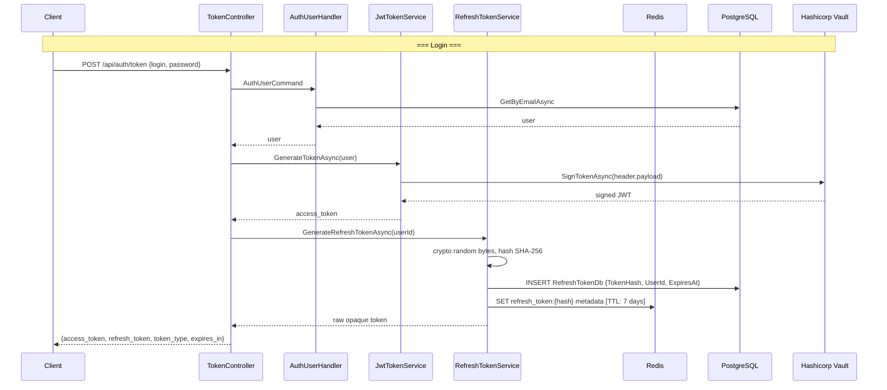
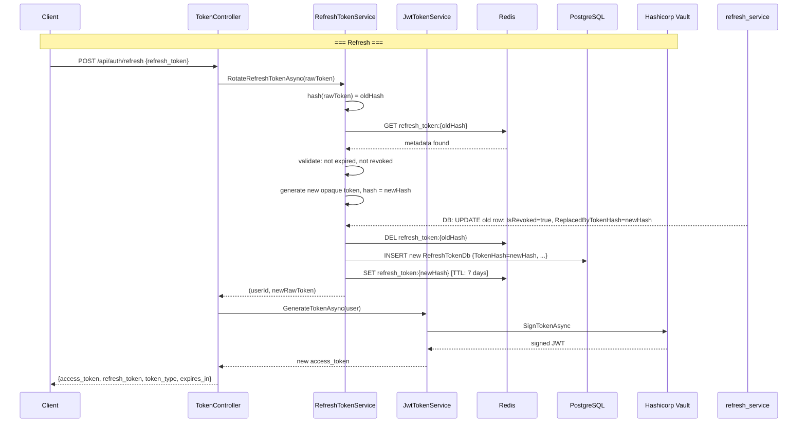
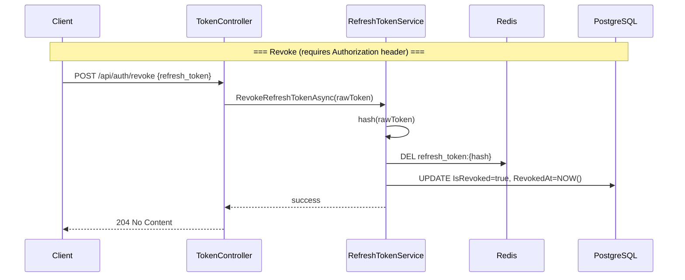
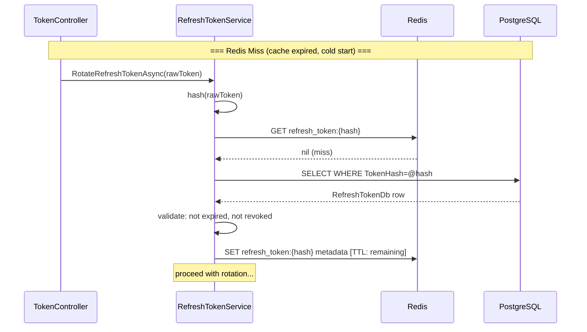

# Access + Refresh Tokens Implementation Plan for FinTrack API

## Overview

Замена текущей single-JWT схемы аутентификации (`POST /api/auth/token` возвращает один access-токен на 3 часа) на пару **Access Token (JWT, 15 min) + Refresh Token (opaque, 7 days)** с простой ротацией refresh-токенов и дублирующим хранением в Redis + PostgreSQL.

Существующий `POST /api/auth/token` модифицируется: ответ меняется с `{ "token": "..." }` на `{ "access_token": "...", "refresh_token": "...", "token_type": "Bearer", "expires_in": 900 }`.

---

## Decisions Summary

| Decision               | Choice                                                                |
| ---------------------- | --------------------------------------------------------------------- |
| Refresh token rotation | **Simple rotation**: старый инвалидируется при каждом рефреше         |
| Refresh token storage  | **Redis (primary) + PostgreSQL (durable)**                            |
| Access token lifetime  | **15 минут**                                                          |
| Refresh token lifetime | **7 дней**                                                            |
| Client delivery        | Оба токена в **JSON-ответе**                                          |
| Refresh token format   | **Opaque** (криптографически случайная строка, base64url)             |
| Revoke endpoint        | **Да** — `POST /api/auth/revoke` (требует access-токен в заголовке)   |
| Backward compatibility | **Нет** — модифицируем существующий `POST /api/auth/token`            |
| Хеширование в БД       | Refresh-токен хранится как **SHA-256 хеш** (raw-токен не сохраняется) |

---

## Architecture Diagrams

### Login / Token Issuance



### Refresh (Rotation)



### Revoke



### Redis Miss — DB Fallback



---

## Phase 1: Database — RefreshTokens Table

### 1.1 `RefreshTokenDb` entity

Новый файл: [`FinTrack/FinTrack.API.Infrastructure/Data/DbEntities/RefreshTokenDb.cs`](FinTrack/FinTrack.API.Infrastructure/Data/DbEntities/RefreshTokenDb.cs)

```csharp
namespace FinTrack.API.Infrastructure.Data.DbEntities;

public class RefreshTokenDb
{
    public Guid Id { get; set; }
    public string TokenHash { get; set; } = null!;     // SHA-256 hash of the raw token
    public Guid UserId { get; set; }
    public DateTime ExpiresAt { get; set; }
    public DateTime CreatedAt { get; set; }
    public bool IsRevoked { get; set; }
    public DateTime? RevokedAt { get; set; }
    public string? ReplacedByTokenHash { get; set; }

    // Navigation
    public UserDb User { get; set; } = null!;
}
```

### 1.2 `RefreshTokenConfiguration`

Новый файл: [`FinTrack/FinTrack.API.Infrastructure/Data/Configurations/RefreshTokenConfiguration.cs`](FinTrack/FinTrack.API.Infrastructure/Data/Configurations/RefreshTokenConfiguration.cs)

```csharp
namespace FinTrack.API.Infrastructure.Data.Configurations;

class RefreshTokenConfiguration : IEntityTypeConfiguration<RefreshTokenDb>
{
    public void Configure(EntityTypeBuilder<RefreshTokenDb> builder)
    {
        builder.ToTable("RefreshTokens");

        builder.HasKey(t => t.Id);
        builder.Property(t => t.TokenHash).HasMaxLength(64).IsRequired();
        builder.HasIndex(t => t.TokenHash).IsUnique();
        builder.Property(t => t.UserId).IsRequired();
        builder.Property(t => t.ExpiresAt).IsRequired();
        builder.Property(t => t.CreatedAt).IsRequired();
        builder.Property(t => t.IsRevoked).IsRequired();
        builder.Property(t => t.ReplacedByTokenHash).HasMaxLength(64);

        builder.HasIndex(t => t.UserId);  // for querying all user's tokens

        builder.HasOne(t => t.User)
            .WithMany()
            .HasForeignKey(t => t.UserId)
            .OnDelete(DeleteBehavior.Cascade);
    }
}
```

### 1.3 `DatabaseClient` modification

Добавить `DbSet<RefreshTokenDb>` и применить конфигурацию в [`DatabaseClient.cs`](FinTrack/FinTrack.API.Infrastructure/Data/DatabaseClient.cs:11):

```csharp
public DbSet<RefreshTokenDb> RefreshTokens { get; set; }

// In OnModelCreating:
modelBuilder.ApplyConfiguration(new RefreshTokenConfiguration());
```

### 1.4 EF Core Migration

Создать миграцию:

```bash
cd FinTrack/FinTrack.API.Infrastructure
dotnet ef migrations add AddRefreshTokens --startup-project ../FinTrack.API
```

---

## Phase 2: Core — JwtOptions Extension

### 2.1 Extend `JwtOptions`

Модифицировать файл: [`FinTrack/FinTrack.API.Infrastructure/Identity/DTO/JwtOptions.cs`](FinTrack/FinTrack.API.Infrastructure/Identity/DTO/JwtOptions.cs:4)

Добавить два новых свойства:

```csharp
public class JwtOptions
{
    public string Issuer { get; set; } = null!;
    public string Audience { get; set; } = null!;

    // === existing (will be repurposed as access token lifetime) ===
    public TimeSpan LifeTime { get; set; }

    // === new ===
    public TimeSpan RefreshTokenLifeTime { get; set; }
}
```

### 2.2 Update `appsettings.json`

Модифицировать секцию `JwtOptions` в [`appsettings.json`](FinTrack/FinTrack.API/appsettings.json:50):

```json
"JwtOptions": {
    "Issuer": "http://fintrack.api",
    "Audience": "http://fintrack.api",
    "LifeTime": "00:15:00",
    "RefreshTokenLifeTime": "7.00:00:00"
}
```

**Важно:** `LifeTime` меняется с 3 часов на 15 минут. Это ломает обратную совместимость для старых токенов — но они и так истекут через максимум 3 часа после деплоя.

---

## Phase 3: Application Layer — Contracts

### 3.1 `IRefreshTokenService` interface

Новый файл: [`FinTrack/FinTrack.API.Application/Interfaces/IRefreshTokenService.cs`](FinTrack/FinTrack.API.Application/Interfaces/IRefreshTokenService.cs)

```csharp
namespace FinTrack.API.Application.Interfaces;

/// <summary>
/// Service for managing opaque refresh tokens (generation, validation, rotation, revocation).
/// </summary>
public interface IRefreshTokenService
{
    /// <summary>
    /// Generates a new refresh token for the user.
    /// Returns the raw opaque token string to be sent to the client.
    /// </summary>
    Task<string> GenerateRefreshTokenAsync(Guid userId, CancellationToken ct = default);

    /// <summary>
    /// Validates the raw refresh token, revokes the old one, and generates a new pair.
    /// Returns (userId, newRawToken) on success.
    /// Throws on invalid/expired/revoked token.
    /// </summary>
    Task<RefreshTokenRotationResult> RotateRefreshTokenAsync(string rawToken, CancellationToken ct = default);

    /// <summary>
    /// Revokes a specific refresh token (logout).
    /// Does not throw if token is already revoked or not found (idempotent).
    /// </summary>
    Task RevokeRefreshTokenAsync(string rawToken, CancellationToken ct = default);
}

public record RefreshTokenRotationResult(Guid UserId, string NewRefreshToken);
```

### 3.2 Exception types for refresh token errors

Новый файл: [`FinTrack/FinTrack.API.Core/Exceptions/RefreshTokenException.cs`](FinTrack/FinTrack.API.Core/Exceptions/RefreshTokenException.cs)

```csharp
namespace FinTrack.API.Core.Exceptions;

public class RefreshTokenException : Exception
{
    public string Reason { get; }

    public RefreshTokenException(string reason) : base($"Refresh token invalid: {reason}")
    {
        Reason = reason;
    }
}
```

Используется для случаев: «token not found», «token expired», «token revoked».

---

## Phase 4: Infrastructure — RefreshTokenService

### 4.1 `RefreshTokenService`

Новый файл: [`FinTrack/FinTrack.API.Infrastructure/Identity/Services/RefreshTokenService.cs`](FinTrack/FinTrack.API.Infrastructure/Identity/Services/RefreshTokenService.cs)

**Ключевые зависимости:**

- `DatabaseClient` (EF Core, scoped) — для записи/чтения из PostgreSQL
- `ICacheService` (из Redis-плана) — для кэша в Redis. **Важно**: `RefreshTokenService` должен быть **Scoped** (как и DbContext), а не Singleton. Но `ICacheService` — Singleton. Это ок, т.к. `IDistributedCache` потокобезопасен.

**Алгоритм `GenerateRefreshTokenAsync`:**

1. Генерирует 32 криптографически случайных байта (`RandomNumberGenerator.Fill`)
2. Кодирует в base64url: `Convert.ToBase64String(bytes).Replace('+', '-').Replace('/', '_').TrimEnd('=')`
3. Хеширует через SHA-256: `Convert.ToHexString(SHA256.HashData(rawBytes))`
4. Сохраняет `RefreshTokenDb` в БД
5. Сохраняет `{ "userId": "...", "expiresAt": "..." }` в Redis с ключом `refresh_token:{hash}` и TTL = оставшееся время
6. Возвращает raw opaque токен (п.2)

**Алгоритм `RotateRefreshTokenAsync`:**

1. Декодирует raw-токен из base64url → bytes, хеширует SHA-256 → `oldHash`
2. Ищет в Redis: `GET refresh_token:{oldHash}`
3. Если Redis miss → ищет в БД по `TokenHash == oldHash`
4. Валидирует: `ExpiresAt > DateTime.UtcNow`, `IsRevoked == false`
5. **Invalidates old token**: `IsRevoked = true`, `RevokedAt = DateTime.UtcNow`, удаляет ключ из Redis
6. Генерирует новый токен (как в `GenerateRefreshTokenAsync`), пишет `ReplacedByTokenHash = newHash` в старую запись
7. Сохраняет новый токен в БД + Redis
8. Возвращает `(UserId, newRawToken)`

**Алгоритм `RevokeRefreshTokenAsync`:**

1. Декодирует raw-токен → hash
2. `Redis: DEL refresh_token:{hash}`
3. `DB: UPDATE IsRevoked = true WHERE TokenHash = @hash`
4. Не бросает исключений, если токен не найден (идемпотентно)

```csharp
namespace FinTrack.API.Infrastructure.Identity.Services;

public class RefreshTokenService : IRefreshTokenService
{
    private readonly DatabaseClient _db;
    private readonly ICacheService _cache;
    private readonly IOptions<JwtOptions> _jwtOptions;
    private readonly ILogger<RefreshTokenService> _logger;

    private const string RedisKeyPrefix = "refresh_token:";
    private TimeSpan RefreshTtl => _jwtOptions.Value.RefreshTokenLifeTime;

    public RefreshTokenService(
        DatabaseClient db,
        ICacheService cache,
        IOptions<JwtOptions> jwtOptions,
        ILogger<RefreshTokenService> logger)
    {
        _db = db;
        _cache = cache;
        _jwtOptions = jwtOptions;
        _logger = logger;
    }

    public async Task<string> GenerateRefreshTokenAsync(Guid userId, CancellationToken ct = default)
    {
        var (rawToken, hash, bytes) = GenerateTokenWithHash();

        var record = new RefreshTokenDb
        {
            Id = Guid.NewGuid(),
            TokenHash = hash,
            UserId = userId,
            ExpiresAt = DateTime.UtcNow.Add(RefreshTtl),
            CreatedAt = DateTime.UtcNow,
            IsRevoked = false
        };

        _db.RefreshTokens.Add(record);
        await _db.SaveChangesAsync(ct);

        var cacheEntry = JsonSerializer.Serialize(new RefreshTokenCacheEntry(userId, record.ExpiresAt));
        await _cache.SetAsync($"{RedisKeyPrefix}{hash}", cacheEntry, RefreshTtl, ct);

        return rawToken;
    }

    public async Task<RefreshTokenRotationResult> RotateRefreshTokenAsync(string rawToken, CancellationToken ct = default)
    {
        var oldHash = HashToken(rawToken);
        var oldDb = await FindAndValidateTokenAsync(oldHash, ct);

        // Revoke old
        oldDb.IsRevoked = true;
        oldDb.RevokedAt = DateTime.UtcNow;
        await _cache.RemoveAsync($"{RedisKeyPrefix}{oldHash}", ct);

        // Generate new
        var (newRawToken, newHash, _) = GenerateTokenWithHash();

        oldDb.ReplacedByTokenHash = newHash;

        var newRecord = new RefreshTokenDb
        {
            Id = Guid.NewGuid(),
            TokenHash = newHash,
            UserId = oldDb.UserId,
            ExpiresAt = DateTime.UtcNow.Add(RefreshTtl),
            CreatedAt = DateTime.UtcNow,
            IsRevoked = false
        };

        _db.RefreshTokens.Add(newRecord);
        await _db.SaveChangesAsync(ct);

        var cacheEntry = JsonSerializer.Serialize(new RefreshTokenCacheEntry(oldDb.UserId, newRecord.ExpiresAt));
        await _cache.SetAsync($"{RedisKeyPrefix}{newHash}", cacheEntry, RefreshTtl, ct);

        _logger.LogInformation("Refresh token rotated for user {UserId}", oldDb.UserId);

        return new RefreshTokenRotationResult(oldDb.UserId, newRawToken);
    }

    public async Task RevokeRefreshTokenAsync(string rawToken, CancellationToken ct = default)
    {
        var hash = HashToken(rawToken);
        await _cache.RemoveAsync($"{RedisKeyPrefix}{hash}", ct);

        var record = await _db.RefreshTokens.FirstOrDefaultAsync(t => t.TokenHash == hash, ct);
        if (record is not null && !record.IsRevoked)
        {
            record.IsRevoked = true;
            record.RevokedAt = DateTime.UtcNow;
            await _db.SaveChangesAsync(ct);
            _logger.LogInformation("Refresh token revoked for user {UserId}", record.UserId);
        }
    }

    // --- private helpers ---

    private async Task<RefreshTokenDb> FindAndValidateTokenAsync(string hash, CancellationToken ct)
    {
        // 1. Try Redis
        var cached = await _cache.GetAsync<RefreshTokenCacheEntry>($"{RedisKeyPrefix}{hash}", ct);
        if (cached is not null)
        {
            // Still need full DB row for update
            var dbRow = await _db.RefreshTokens.FirstOrDefaultAsync(t => t.TokenHash == hash, ct);
            if (dbRow is not null)
            {
                ValidateToken(dbRow);
                return dbRow;
            }
        }

        // 2. Fallback to DB
        var fromDb = await _db.RefreshTokens.FirstOrDefaultAsync(t => t.TokenHash == hash, ct);
        if (fromDb is null)
            throw new RefreshTokenException("token not found");

        ValidateToken(fromDb);

        // Repopulate Redis cache
        var cacheEntry = JsonSerializer.Serialize(new RefreshTokenCacheEntry(fromDb.UserId, fromDb.ExpiresAt));
        var remainingTtl = fromDb.ExpiresAt - DateTime.UtcNow;
        if (remainingTtl > TimeSpan.Zero)
            await _cache.SetAsync($"{RedisKeyPrefix}{hash}", cacheEntry, remainingTtl, ct);

        return fromDb;
    }

    private static void ValidateToken(RefreshTokenDb token)
    {
        if (token.IsRevoked)
            throw new RefreshTokenException("token revoked");
        if (token.ExpiresAt <= DateTime.UtcNow)
            throw new RefreshTokenException("token expired");
    }

    private static (string rawToken, string hash, byte[] bytes) GenerateTokenWithHash()
    {
        var bytes = new byte[32];
        RandomNumberGenerator.Fill(bytes);
        var rawToken = Convert.ToBase64String(bytes)
            .Replace('+', '-')
            .Replace('/', '_')
            .TrimEnd('=');
        var hash = Convert.ToHexString(SHA256.HashData(bytes));
        return (rawToken, hash, bytes);
    }

    private static string HashToken(string rawToken)
    {
        // Restore base64 padding, decode, then hash
        var base64 = rawToken.Replace('-', '+').Replace('_', '/');
        var padding = (base64.Length % 4) switch
        {
            2 => "==",
            3 => "=",
            _ => ""
        };
        var bytes = Convert.FromBase64String(base64 + padding);
        return Convert.ToHexString(SHA256.HashData(bytes));
    }

    internal record RefreshTokenCacheEntry(Guid UserId, DateTime ExpiresAt);
}
```

**Примечание по Redis kлючу:** Ключ `refresh_token:{hash}` содержит 64 hex символов. Полный ключ: `FinTrack:refresh_token:{hash}` (с учётом `InstanceName` из конфигурации Redis). `RemoveByPatternAsync` не нужен для refresh-токенов — удаление всегда точечное по hash.

**Примечание по отсутствию `RemoveByPatternAsync` для revoke-all-user-tokens:** Если в будущем потребуется «выйти на всех устройствах», можно добавить отдельный метод, который ищет в БД все токены пользователя и инвалидирует их по одному.

---

## Phase 5: TokenController Modifications

### 5.1 `POST /api/auth/token` — модификация

Модифицировать [`TokenController.cs`](FinTrack/FinTrack.API/Controllers/TokenController.cs:49):

**Было:**

```csharp
return Ok(new { token });
```

**Стало:**

```csharp
var accessToken = await _jwtTokenService.GenerateTokenAsync(result.Value);
var refreshToken = await _refreshTokenService.GenerateRefreshTokenAsync(result.Value.Id);

return Ok(new
{
    access_token = accessToken,
    refresh_token = refreshToken,
    token_type = "Bearer",
    expires_in = 900  // 15 minutes in seconds
});
```

**Сваггер-документация обновляется** — пример ответа меняется.

### 5.2 `POST /api/auth/refresh` — новый эндпоинт

Добавить в [`TokenController`](FinTrack/FinTrack.API/Controllers/TokenController.cs):

```csharp
/// <summary>
/// Refreshes access and refresh token pair.
/// </summary>
/// <remarks>
/// Request example:
/// POST /api/auth/refresh
/// {
///     "refresh_token": "YOUR_REFRESH_TOKEN"
/// }
///
/// Response example:
/// {
///     "access_token": "eyJ...",
///     "refresh_token": "...",
///     "token_type": "Bearer",
///     "expires_in": 900
/// }
/// </remarks>
/// <response code="200">New token pair issued</response>
/// <response code="401">Refresh token invalid, expired, or revoked</response>
[HttpPost("refresh")]
[Produces("application/json")]
[Consumes("application/json")]
[ProducesResponseType(StatusCodes.Status200OK)]
[ProducesResponseType(StatusCodes.Status401Unauthorized, Type = typeof(ProblemDetails))]
public async Task<IActionResult> RefreshToken([FromBody] RefreshTokenRequest request)
{
    try
    {
        var result = await _refreshTokenService.RotateRefreshTokenAsync(request.RefreshToken);
        var user = await _userRepository.GetByIdAsync(result.UserId);
        if (user is null)
            return Unauthorized("User not found");

        var accessToken = await _jwtTokenService.GenerateTokenAsync(user);
        return Ok(new
        {
            access_token = accessToken,
            refresh_token = result.NewRefreshToken,
            token_type = "Bearer",
            expires_in = 900
        });
    }
    catch (RefreshTokenException ex)
    {
        return Unauthorized(new ProblemDetails
        {
            Title = "Invalid refresh token",
            Detail = ex.Reason,
            Status = StatusCodes.Status401Unauthorized
        });
    }
}
```

### 5.3 `POST /api/auth/revoke` — новый эндпоинт

Добавить в [`TokenController`](FinTrack/FinTrack.API/Controllers/TokenController.cs):

```csharp
/// <summary>
/// Revokes a refresh token (logout).
/// Requires a valid access token in Authorization header.
/// </summary>
/// <remarks>
/// Request example:
/// POST /api/auth/revoke
/// Authorization: Bearer YOUR_ACCESS_TOKEN
/// {
///     "refresh_token": "YOUR_REFRESH_TOKEN"
/// }
///
/// Response: 204 No Content
/// </remarks>
/// <response code="204">Token revoked</response>
/// <response code="401">Access token invalid</response>
[Authorize]
[HttpPost("revoke")]
[Produces("application/json")]
[Consumes("application/json")]
[ProducesResponseType(StatusCodes.Status204NoContent)]
[ProducesResponseType(StatusCodes.Status401Unauthorized, Type = typeof(ProblemDetails))]
public async Task<IActionResult> RevokeToken([FromBody] RefreshTokenRequest request)
{
    await _refreshTokenService.RevokeRefreshTokenAsync(request.RefreshToken);
    return NoContent();
}
```

**Примечание:** Revoke требует валидный access-токен в заголовке `Authorization`. Это защищает от злоумышленников, которые получили доступ к refresh-токену, но не к access-токену (revoke без access-токена невозможен). Такой подход менее удобен, но более безопасен. Если нужен revoke без access-токена (например, при истечении access), можно убрать `[Authorize]`, но тогда злоумышленник с украденным refresh-токеном сможет ревокать другие токены жертвы.

### 5.4 Новые DTO

Новый файл: [`FinTrack/FinTrack.API/DTO/RefreshTokenRequest.cs`](FinTrack/FinTrack.API/DTO/RefreshTokenRequest.cs)

```csharp
namespace FinTrack.API.DTO;

public record RefreshTokenRequest(string RefreshToken);
```

### 5.5 Новые зависимости в TokenController

Контроллер теперь требует:

- `IRefreshTokenService` (новая)
- `IUserRepository` — нужна для рефреша, чтобы получить `User` по `UserId` и сгенерировать access-токен

Существующие зависимости (`IMediator`, `IJwtTokenService`) остаются.

---

## Phase 6: `IJwtTokenService` — изменения не требуются

Интерфейс [`IJwtTokenService`](FinTrack/FinTrack.API.Application/Interfaces/IJwtTokenService.cs:9) и реализация [`JwtTokenService`](FinTrack/FinTrack.API.Infrastructure/Identity/Services/JwtTokenService.cs:11) **остаются без изменений**.

Единственное изменение — `JwtOptions.LifeTime` в конфигурации меняется с 3 часов на 15 минут (см. Phase 2). `JwtTokenService` считывает `_jwtOptions.LifeTime` внутри `GenerateTokenAsync` — он автоматически начнёт генерировать токены с сокращённым сроком.

---

## Phase 7: DI Registration

Модифицировать `ConfigureServices` в [`Program.cs`](FinTrack/FinTrack.API/Program.cs:146):

### 7.1 RefreshTokenService

```csharp
// Refresh tokens
services.AddScoped<IRefreshTokenService, RefreshTokenService>();
```

Регистрируется **после** регистрации `DatabaseClient` и `ICacheService`.

### 7.2 Порядок регистрации (итоговый)

1. Controllers, Auth, MediatR (без изменений)
2. Configuration: `JwtOptions`, `VaultOptions`, `CacheOptions` (без изменений, плюс обновлённый `JwtOptions` из конфига)
3. Services: `TransferService`, `IJwtTokenService`, `IJwtSigningService`, `IPasswordHasher` (без изменений)
4. Vault HTTP clients (без изменений)
5. AutoMapper (без изменений)
6. Data / DbContext (без изменений)
7. **Redis + `ICacheService` (из Redis-плана) — ДОЛЖЕН БЫТЬ УЖЕ ЗАРЕГИСТРИРОВАН**
8. **`IRefreshTokenService` → `RefreshTokenService` (новое)**
9. Repository registrations + cache decorators (из Redis-плана)
10. Swagger, CORS, ExceptionHandlers, Decorators, Telemetry (без изменений)

---

## Phase 8: Cleanup (Optional / Future)

### 8.1 Периодическая очистка истёкших токенов

Refresh-токены не удаляются из БД автоматически. Рекомендуется добавить background job (или хотя бы вызов при старте приложения):

```csharp
// Удалить все истёкшие/отозванные токены старше 30 дней
await _db.RefreshTokens
    .Where(t => t.ExpiresAt < DateTime.UtcNow.AddDays(-30) || (t.IsRevoked && t.RevokedAt < DateTime.UtcNow.AddDays(-30)))
    .ExecuteDeleteAsync();
```

Это можно сделать как часть `app.Run()` (перед `app.Run()`) или в отдельном `IHostedService`.

Либо можно пропустить этот шаг: объём данных при 7-дневном TTL будет расти линейно, но для B2C-приложения это не критично долгое время.

---

## Phase 9: Integration Tests Updates

### 9.1 `TokenControllerTests` — обновить

Файл: [`FinTrack/FinTrack.IntegrationTests/API/TokenControllerTests.cs`](FinTrack/FinTrack.IntegrationTests/API/TokenControllerTests.cs)

Обновить существующие тесты:

- Проверять, что ответ содержит `access_token`, `refresh_token`, `token_type`, `expires_in`

Добавить новые тесты:

| Тест                                         | Описание                                              |
| -------------------------------------------- | ----------------------------------------------------- |
| `GetJwtToken_Returns_AccessAndRefreshTokens` | Успешный логин возвращает оба токена                  |
| `RefreshToken_ValidToken_ReturnsNewPair`     | Валидный refresh-токен даёт новую пару                |
| `RefreshToken_OldTokenRevoked_AfterRotation` | После рефреша старый refresh-токен больше не работает |
| `RefreshToken_Expired_Returns401`            | Истёкший refresh-токен отклоняется                    |
| `RefreshToken_Revoked_Returns401`            | Отозванный refresh-токен отклоняется                  |
| `RefreshToken_InvalidFormat_Returns401`      | Некорректный формат токена → 401                      |
| `RevokeToken_Authorized_Returns204`          | Авторизованный revoke возвращает 204                  |
| `RevokeToken_Unauthorized_Returns401`        | Revoke без access-токена → 401                        |
| `RevokedToken_CannotRefresh_Returns401`      | После revoke токен нельзя использовать для рефреша    |

### 9.2 Test Fixture адаптация

- [`FinTrackWebApplicationFactory`](FinTrack/FinTrack.IntegrationTests/Common/FinTrackWebApplicationFactory.cs) — если тесты используют реальный (in-memory) Redis — то `IRefreshTokenService` должен быть подменён на mock/stub, либо Redis должен быть доступен в CI.
- Альтернатива: регистрировать mock `IRefreshTokenService` в `TestMocks` (см. Phase 10).

---

## Phase 10: Test Mocks

### 10.1 `RefreshTokenServiceMock`

Новый файл: [`FinTrack/FinTrack.API.TestMocks/Services/RefreshTokenServiceMock.cs`](FinTrack/FinTrack.API.TestMocks/Services/RefreshTokenServiceMock.cs)

```csharp
namespace FinTrack.API.TestMocks.Services;

public class RefreshTokenServiceMock : IRefreshTokenService
{
    private readonly Dictionary<string, RefreshTokenState> _store = new();

    public Task<string> GenerateRefreshTokenAsync(Guid userId, CancellationToken ct = default)
    {
        var raw = Guid.NewGuid().ToString("N");
        _store[raw] = new RefreshTokenState(userId, DateTime.UtcNow.AddDays(7), revoked: false);
        return Task.FromResult(raw);
    }

    public Task<RefreshTokenRotationResult> RotateRefreshTokenAsync(string rawToken, CancellationToken ct = default)
    {
        if (!_store.TryGetValue(rawToken, out var state))
            throw new RefreshTokenException("token not found");
        if (state.Revoked)
            throw new RefreshTokenException("token revoked");
        if (state.ExpiresAt <= DateTime.UtcNow)
            throw new RefreshTokenException("token expired");

        state.Revoked = true;
        var newRaw = Guid.NewGuid().ToString("N");
        _store[newRaw] = new RefreshTokenState(state.UserId, DateTime.UtcNow.AddDays(7), revoked: false);
        return Task.FromResult(new RefreshTokenRotationResult(state.UserId, newRaw));
    }

    public Task RevokeRefreshTokenAsync(string rawToken, CancellationToken ct = default)
    {
        if (_store.TryGetValue(rawToken, out var state))
            state.Revoked = true;
        return Task.CompletedTask;
    }

    private class RefreshTokenState
    {
        public Guid UserId { get; }
        public DateTime ExpiresAt { get; }
        public bool Revoked { get; set; }
        public RefreshTokenState(Guid userId, DateTime expiresAt, bool revoked)
        {
            UserId = userId;
            ExpiresAt = expiresAt;
            Revoked = revoked;
        }
    }
}
```

---

## File Manifest

| #   | File                                                                                                                                                                             | Layer | Action                                                               |
| --- | -------------------------------------------------------------------------------------------------------------------------------------------------------------------------------- | ----- | -------------------------------------------------------------------- |
| 1   | [`FinTrack/FinTrack.API.Infrastructure/Data/DbEntities/RefreshTokenDb.cs`](FinTrack/FinTrack.API.Infrastructure/Data/DbEntities/RefreshTokenDb.cs)                               | Infra | **New** — DB entity                                                  |
| 2   | [`FinTrack/FinTrack.API.Infrastructure/Data/Configurations/RefreshTokenConfiguration.cs`](FinTrack/FinTrack.API.Infrastructure/Data/Configurations/RefreshTokenConfiguration.cs) | Infra | **New** — EF Core configuration                                      |
| 3   | [`FinTrack/FinTrack.API.Infrastructure/Data/DatabaseClient.cs`](FinTrack/FinTrack.API.Infrastructure/Data/DatabaseClient.cs)                                                     | Infra | **Modify** — add `DbSet<RefreshTokenDb>`, apply configuration        |
| 4   | [`FinTrack/FinTrack.API.Infrastructure/Identity/DTO/JwtOptions.cs`](FinTrack/FinTrack.API.Infrastructure/Identity/DTO/JwtOptions.cs)                                             | Infra | **Modify** — add `RefreshTokenLifeTime`                              |
| 5   | [`FinTrack/FinTrack.API/appsettings.json`](FinTrack/FinTrack.API/appsettings.json)                                                                                               | API   | **Modify** — `LifeTime` → 15 min, add `RefreshTokenLifeTime`         |
| 6   | [`FinTrack/FinTrack.API.Application/Interfaces/IRefreshTokenService.cs`](FinTrack/FinTrack.API.Application/Interfaces/IRefreshTokenService.cs)                                   | App   | **New** — interface                                                  |
| 7   | [`FinTrack/FinTrack.API.Core/Exceptions/RefreshTokenException.cs`](FinTrack/FinTrack.API.Core/Exceptions/RefreshTokenException.cs)                                               | Core  | **New** — exception type                                             |
| 8   | [`FinTrack/FinTrack.API.Infrastructure/Identity/Services/RefreshTokenService.cs`](FinTrack/FinTrack.API.Infrastructure/Identity/Services/RefreshTokenService.cs)                 | Infra | **New** — implementation                                             |
| 9   | [`FinTrack/FinTrack.API/Controllers/TokenController.cs`](FinTrack/FinTrack.API/Controllers/TokenController.cs)                                                                   | API   | **Modify** — change `GetJwtToken`, add `RefreshToken`, `RevokeToken` |
| 10  | [`FinTrack/FinTrack.API/DTO/RefreshTokenRequest.cs`](FinTrack/FinTrack.API/DTO/RefreshTokenRequest.cs)                                                                           | API   | **New** — request DTO                                                |
| 11  | [`FinTrack/FinTrack.API/Program.cs`](FinTrack/FinTrack.API/Program.cs)                                                                                                           | API   | **Modify** — DI registration                                         |
| 12  | [`FinTrack/FinTrack.API.Infrastructure/Migrations/*.cs`](FinTrack/FinTrack.API.Infrastructure/Migrations/)                                                                       | Infra | **New** — generated migration                                        |
| 13  | [`FinTrack/FinTrack.API.TestMocks/Services/RefreshTokenServiceMock.cs`](FinTrack/FinTrack.API.TestMocks/Services/RefreshTokenServiceMock.cs)                                     | Tests | **New** — mock for tests                                             |
| 14  | [`FinTrack/FinTrack.IntegrationTests/API/TokenControllerTests.cs`](FinTrack/FinTrack.IntegrationTests/API/TokenControllerTests.cs)                                               | Tests | **Modify** — update + add new tests                                  |

---

## Implementation Order

Фазы выполняются последовательно:

1. **Phase 1** — DB entity + configuration + migration
2. **Phase 2** — JwtOptions extension + appsettings update
3. **Phase 3** — `IRefreshTokenService` interface + `RefreshTokenException`
4. **Phase 4** — `RefreshTokenService` implementation
5. **Phase 5** — TokenController modifications (DTO, new endpoints, updated existing)
6. **Phase 6** — Verify `IJwtTokenService` works correctly with new lifetime
7. **Phase 7** — DI registration in `Program.cs`
8. **Phase 8** — (Optional) Periodic cleanup background job
9. **Phase 9** — Integration tests updates
10. **Phase 10** — Test mocks

---

## Pre-requisites

- Redis cache должен быть уже реализован и доступен (план: [`redis-cache-implementation-plan.md`](plans/redis-cache-implementation-plan.md))
- `ICacheService` должен быть зарегистрирован в DI
- Docker-compose включает Redis service

---

## Key Implementation Notes

1. **Scoped vs Singleton**: `RefreshTokenService` должен быть **Scoped**, т.к. зависит от `DatabaseClient` (Scoped EF Core DbContext). Это нормально — `ICacheService` (Singleton) внедряется в scoped-сервис без проблем.

2. **Потокобезопасность при ротации**: При конкурентных запросах на рефреш с одним и тем же токеном возможен race condition — оба запроса видят токен как валидный. Защита: unique constraint на `TokenHash` в БД + обработка `DbUpdateException` при дубликате. Первый запрос заревокает токен и создаст новый, второй получит конфликт — и должен вернуть 401 (старый токен уже невалиден).

3. **Хеширование в БД**: RAW refresh-токен НИКОГДА не сохраняется. Только SHA-256 хеш. При утечке БД raw-токены не скомпрометированы.

4. **Redis TTL = remaining lifetime**: При записи refresh-токена в Redis используется TTL = `ExpiresAt - DateTime.UtcNow`, а не фиксированные 7 дней. Это гарантирует, что Redis не содержит истёкших токенов.

5. **Redis miss handler**: При промахе Redis (падение, cold start) сервис прозрачно фолбечится к PostgreSQL. После успешного lookup-а токен повторно кэшируется в Redis с оставшимся TTL.

6. **Circuit Breaker**: `ICacheService` уже обёрнут `ResilientCacheService` с Circuit Breaker (из Redis-плана). При открытом Circuit все Redis-операции возвращают null / fail-silent — `RefreshTokenService.FindAndValidateTokenAsync` корректно обрабатывает это через DB fallback.

7. **Существующий `GetJwtStatus()`**: Эндпоинт `GET /api/auth/token/status` **остаётся без изменений** — он просто проверяет валидность access-токена через стандартный JWT middleware.

8. **Revoke без access-токена**: Revoke эндпоинт защищён `[Authorize]` — требует действующий access-токен. Это означает, что если access-токен истёк, пользователь НЕ может сделать revoke (только refresh, а затем revoke). Если нужен revoke без валидного access-токена — можно убрать `[Authorize]`, но это снижает безопасность.

9. **Совместимость с 2FA**: План совместим с будущей двухфакторной аутентификацией ([`plans/2fa-implementation-plan.md`](plans/2fa-implementation-plan.md)). Refresh-токен не несёт claims о 2FA — он просто идентифицирует пользователя. Access-токен по-прежнему генерируется через `JwtTokenService`, где можно добавить claim о пройденной 2FA.

---

## Future Enhancements (Out of Scope)

- **Revoke all user tokens** — endpoint для массовой инвалидации всех refresh-токенов пользователя (например, при смене пароля)
- **Token family detection** — защита от replay-атак через familyId (если старый токен используется повторно — инвалидируется вся семья)
- **Device fingerprinting** — сохранение IP/User-Agent в refresh-токене для дополнительной валидации
- **Refresh token rotation window** — grace period (несколько секунд), в течение которого старый токен всё ещё принимается, для защиты от сетевых гонок
- **Sliding expiration** — продление TTL refresh-токена при каждом использовании (вместо полной ротации)
