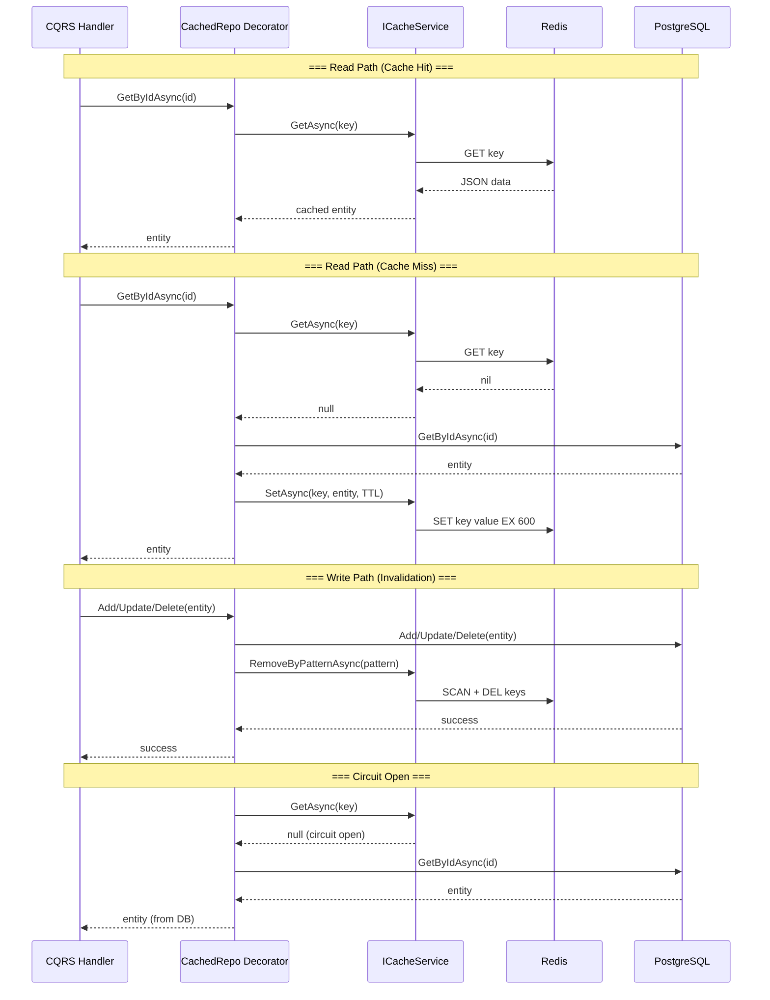

# Redis Cache Implementation Plan for FinTrack API

## Overview

Добавление Redis как сервиса кэширования в docker-compose. Реализация паттерна декоратор над репозиториями для кэширования read-операций с гибридной стратегией инвалидации (точечное удаление ключей + TTL) и Circuit Breaker для отказоустойчивости.

---

## Decisions Summary

| Decision            | Choice                                                                          |
| ------------------- | ------------------------------------------------------------------------------- |
| Инвалидация         | **Гибридная**: точечное удаление ключей + 10-минутный TTL                       |
| Кэшируемые сущности | **User** (все read), **Account** (все read), **Transaction** (только `GetById`) |
| Redis-клиент        | `IDistributedCache` + `IConnectionMultiplexer` (StackExchange.Redis)            |
| Circuit Breaker     | **Polly.Core**: sampling 30s / min throughput 15 / failure 40% / break 45s      |
| Fallback при обрыве | Пропуск кэша, запрос напрямую в БД, логирование Warning                         |
| TTL                 | 10 минут (absolute expiration)                                                  |
| Сериализация        | JSON (`System.Text.Json`)                                                       |
| Паттерн             | **Декоратор** (Scrutor `Decorate<>`, уже используется в проекте)                |
| Health Check        | Redis health check endpoint                                                     |

---

## Architecture Diagram



---

## Phase 1: Infrastructure — Redis in docker-compose

### 1.1 `docker-compose.yml` — Redis service

Добавить секцию `redis` в [`FinTrack/docker-compose.yml`](FinTrack/docker-compose.yml):

```yaml
redis:
  image: redis:8.2-alpine
  ports:
    - "6379:6379"
  volumes:
    - redis-data:/data
  command: redis-server --appendonly yes --maxmemory 256mb --maxmemory-policy allkeys-lru
  healthcheck:
    test: ["CMD", "redis-cli", "ping"]
    interval: 10s
    timeout: 3s
    retries: 3
    start_period: 5s
  networks:
    - api-network
```

**Параметры запуска:**

- `--appendonly yes` — персистентность (AOF), чтобы кэш не сбрасывался при рестарте
- `--maxmemory 256mb` — лимит памяти
- `--maxmemory-policy allkeys-lru` — при превышении лимита вытеснять least recently used ключи

### 1.2 Новый volume

```yaml
volumes:
  # ...existing volumes...
  redis-data:
```

### 1.3 `depends_on` для API

Добавить `redis` в зависимости `fintrack.api`:

```yaml
depends_on:
  db:
    condition: service_healthy
  redis:
    condition: service_healthy
  # ... остальные ...
```

### 1.4 Environment variables (`.env`)

```
REDIS_HOST=redis
REDIS_PORT=6379
REDIS_PASSWORD=
```

---

## Phase 2: Core Contracts

### 2.1 `ICacheService` interface

Новый файл: [`FinTrack/FinTrack.API.Core/Interfaces/ICacheService.cs`](FinTrack/FinTrack.API.Core/Interfaces/ICacheService.cs)

```csharp
namespace FinTrack.API.Core.Interfaces;

public interface ICacheService
{
    /// <summary>
    /// Извлекает кэшированное значение по ключу.
    /// Возвращает null при промахе или недоступности Redis.
    /// </summary>
    Task<T?> GetAsync<T>(string key, CancellationToken ct = default) where T : class;

    /// <summary>
    /// Сохраняет значение в кэш с абсолютным TTL.
    /// </summary>
    Task SetAsync<T>(string key, T value, TimeSpan ttl, CancellationToken ct = default) where T : class;

    /// <summary>
    /// Удаляет конкретный ключ.
    /// </summary>
    Task RemoveAsync(string key, CancellationToken ct = default);

    /// <summary>
    /// Удаляет все ключи, соответствующие паттерну (например, "users:all:*").
    /// </summary>
    Task RemoveByPatternAsync(string pattern, CancellationToken ct = default);
}
```

### 2.2 `CacheOptions` record

Новый файл: [`FinTrack/FinTrack.API.Core/Common/CacheOptions.cs`](FinTrack/FinTrack.API.Core/Common/CacheOptions.cs)

```csharp
namespace FinTrack.API.Core.Common;

public record CacheOptions
{
    public TimeSpan DefaultTtl { get; init; } = TimeSpan.FromMinutes(10);
    public TimeSpan MaxTtl { get; init; } = TimeSpan.FromHours(1);
}
```

### 2.3 `CacheKeyFactory` — helper для генерации ключей

Новый файл: [`FinTrack/FinTrack.API.Infrastructure/Caching/CacheKeyFactory.cs`](FinTrack/FinTrack.API.Infrastructure/Caching/CacheKeyFactory.cs)

Статические методы для построения ключей:

| Метод                             | Ключ                         |
| --------------------------------- | ---------------------------- |
| `UserById(Guid id)`               | `user:{id}`                  |
| `UserByEmail(string email)`       | `user:email:{email}`         |
| `AllUsers(int page, int size)`    | `users:all:{page}:{size}`    |
| `AccountById(Guid id)`            | `account:{id}`               |
| `AllAccounts(int page, int size)` | `accounts:all:{page}:{size}` |
| `AccountIdsByUser(Guid userId)`   | `accounts:user:{userId}`     |
| `TransactionById(Guid id)`        | `transaction:{id}`           |

И соответствующие паттерны для инвалидации:

```csharp
public static class CacheKeyPatterns
{
    public const string AllUsers = "users:all:*";
    public const string UserById = "user:{0}";
    public const string UserByEmail = "user:email:{0}";

    public const string AllAccounts = "accounts:all:*";
    public const string AccountsByUser = "accounts:user:*";
    public const string AccountById = "account:{0}";
}
```

---

## Phase 3: Redis Cache Service

### 3.1 `RedisCacheService` implementation

Новый файл: [`FinTrack/FinTrack.API.Infrastructure/Caching/RedisCacheService.cs`](FinTrack/FinTrack.API.Infrastructure/Caching/RedisCacheService.cs)

Реализует `ICacheService`. Внутри использует:

- `IDistributedCache` — для простых операций `Get`/`Set`/`Remove`
- `IConnectionMultiplexer` — для `RemoveByPatternAsync` (через `IServer.KeysAsync()`)

```csharp
namespace FinTrack.API.Infrastructure.Caching;

public class RedisCacheService : ICacheService
{
    private readonly IDistributedCache _cache;
    private readonly IConnectionMultiplexer _redis;
    private readonly ILogger<RedisCacheService> _logger;
    private readonly JsonSerializerOptions _jsonOptions;

    public RedisCacheService(
        IDistributedCache cache,
        IConnectionMultiplexer redis,
        ILogger<RedisCacheService> logger)
    {
        _cache = cache;
        _redis = redis;
        _logger = logger;
        _jsonOptions = new JsonSerializerOptions
        {
            PropertyNamingPolicy = JsonNamingPolicy.CamelCase,
            DefaultIgnoreCondition = JsonIgnoreCondition.WhenWritingNull
        };
    }

    public async Task<T?> GetAsync<T>(string key, CancellationToken ct = default) where T : class
    {
        var data = await _cache.GetStringAsync(key, ct);
        if (data is null) return null;
        return JsonSerializer.Deserialize<T>(data, _jsonOptions);
    }

    public async Task SetAsync<T>(string key, T value, TimeSpan ttl, CancellationToken ct = default) where T : class
    {
        var data = JsonSerializer.Serialize(value, _jsonOptions);
        var options = new DistributedCacheEntryOptions
        {
            AbsoluteExpirationRelativeToNow = ttl
        };
        await _cache.SetStringAsync(key, data, options, ct);
    }

    public Task RemoveAsync(string key, CancellationToken ct = default)
    {
        return _cache.RemoveAsync(key, ct);
    }

    public async Task RemoveByPatternAsync(string pattern, CancellationToken ct = default)
    {
        // Используем IConnectionMultiplexer для SCAN + DEL
        var server = _redis.GetServer(_redis.GetEndPoints().First());
        await foreach (var key in server.KeysAsync(pattern: pattern).WithCancellation(ct))
        {
            await _cache.RemoveAsync(key!, ct);
        }
    }
}
```

**Важно:** `RemoveByPatternAsync` использует `IServer.KeysAsync()` с паттерном. Для production с Sentinel/Cluster-топологией потребуется адаптация, но для текущей single-node конфигурации этого достаточно.

### 3.2 `ResilientCacheService` — декоратор с Circuit Breaker

Новый файл: [`FinTrack/FinTrack.API.Infrastructure/Caching/ResilientCacheService.cs`](FinTrack/FinTrack.API.Infrastructure/Caching/ResilientCacheService.cs)

Декоратор над `ICacheService`, добавляющий Circuit Breaker через Polly:

```csharp
namespace FinTrack.API.Infrastructure.Caching;

public class ResilientCacheService : ICacheService
{
    private readonly ICacheService _inner;
    private readonly ResiliencePipeline _pipeline;
    private readonly ILogger<ResilientCacheService> _logger;

    public ResilientCacheService(
        ICacheService inner,
        [FromKeyedServices("redis-pipeline")] ResiliencePipeline pipeline,
        ILogger<ResilientCacheService> logger)
    {
        _inner = inner;
        _pipeline = pipeline;
        _logger = logger;
    }

    public async Task<T?> GetAsync<T>(string key, CancellationToken ct = default) where T : class
    {
        try
        {
            return await _pipeline.ExecuteAsync(
                static async (state, ct) =>
                {
                    var (self, key) = state;
                    return await self._inner.GetAsync<T>(key, ct);
                },
                (self: this, key),
                ct);
        }
        catch (Exception ex)
        {
            _logger.LogWarning(ex, "Redis unavailable for GET {Key}, falling through to DB", key);
            return null; // fail-open
        }
    }

    public async Task SetAsync<T>(string key, T value, TimeSpan ttl, CancellationToken ct = default) where T : class
    {
        try
        {
            await _pipeline.ExecuteAsync(
                static async (state, ct) =>
                {
                    var (self, key, value, ttl) = state;
                    await self._inner.SetAsync(key, value, ttl, ct);
                },
                (self: this, key, value, ttl),
                ct);
        }
        catch (Exception ex)
        {
            _logger.LogWarning(ex, "Redis unavailable for SET {Key}", key);
            // fail-silent: запись в кэш — не критично
        }
    }

    // RemoveAsync и RemoveByPatternAsync — аналогично, с fail-silent
}
```

**Circuit Breaker конфигурация** (регистрируется в DI):

```csharp
// Sampling duration: 30s, min throughput: 15, failure threshold: 40%, break: 45s
var pipeline = new ResiliencePipelineBuilder()
    .AddCircuitBreaker(new CircuitBreakerStrategyOptions
    {
        SamplingDuration = TimeSpan.FromSeconds(30),
        MinimumThroughput = 15,
        FailureRatio = 0.4,
        BreakDuration = TimeSpan.FromSeconds(45),
        OnOpened = args =>
        {
            args.Context.Properties.TryGetValue(LoggerKey, out var logger);
            (logger as ILogger)?.LogWarning("Redis circuit OPENED — bypassing cache for {BreakDuration}s",
                args.BreakDuration.TotalSeconds);
            return ValueTask.CompletedTask;
        },
        OnClosed = args =>
        {
            args.Context.Properties.TryGetValue(LoggerKey, out var logger);
            (logger as ILogger)?.LogInformation("Redis circuit CLOSED — cache restored");
            return ValueTask.CompletedTask;
        },
        OnHalfOpened = args =>
        {
            args.Context.Properties.TryGetValue(LoggerKey, out var logger);
            (logger as ILogger)?.LogInformation("Redis circuit HALF-OPEN — testing connectivity");
            return ValueTask.CompletedTask;
        }
    })
    .Build();
```

---

## Phase 4: Repository Decorators

### 4.1 `CachedUserRepository`

Новый файл: [`FinTrack/FinTrack.API.Infrastructure/Decorators/CachedUserRepository.cs`](FinTrack/FinTrack.API.Infrastructure/Decorators/CachedUserRepository.cs)

Декорирует [`IUserRepository`](FinTrack/FinTrack.API.Core/Interfaces/IUserRepository.cs:5). Кэширует все read-методы.

| Метод                     | Ключ / Паттерн                                                                 |
| ------------------------- | ------------------------------------------------------------------------------ |
| `GetByIdAsync(id)`        | `user:{id}`                                                                    |
| `GetByEmailAsync(email)`  | `user:email:{email}`                                                           |
| `GetAllAsync(page, size)` | `users:all:{page}:{size}`                                                      |
| `Add(user)`               | → DB, затем `RemoveAsync("user:{id}")` + `RemoveByPatternAsync("users:all:*")` |
| `UpdateAsync(user)`       | → DB, затем `RemoveAsync("user:{id}")` + `RemoveByPatternAsync("users:all:*")` |
| `DeleteAsync(id)`         | → DB, затем `RemoveAsync("user:{id}")` + `RemoveByPatternAsync("users:all:*")` |
| `SaveChangesAsync()`      | Делегирует внутрь                                                              |

**Важно:** `GetByEmailAsync` при инвалидации нужно отдельно удалять `user:email:{email}`, поэтому декоратор должен знать email сущности при вызове `UpdateAsync`/`DeleteAsync`.

**Шаблон для `GetByIdAsync`:**

```csharp
public async Task<User?> GetByIdAsync(Guid id)
{
    var key = CacheKeyFactory.UserById(id);
    var cached = await _cache.GetAsync<User>(key);
    if (cached is not null)
        return cached;

    var user = await _inner.GetByIdAsync(id);
    if (user is not null)
        await _cache.SetAsync(key, user, _ttl);

    return user;
}
```

**Шаблон для `Add`/`UpdateAsync`/`DeleteAsync`** (инвалидация):

```csharp
public async Task DeleteAsync(Guid id)
{
    // Инвалидируем ДО удаления, чтобы узнать email (оптимистично)
    var user = await _inner.GetByIdAsync(id);
    await _inner.DeleteAsync(id);

    // Точечная инвалидация
    await _cache.RemoveAsync(CacheKeyFactory.UserById(id));
    if (user?.Email is not null)
        await _cache.RemoveAsync(CacheKeyFactory.UserByEmail(user.Email));
    // Пакетная инвалидация списков
    await _cache.RemoveByPatternAsync(CacheKeyPatterns.AllUsers);
}
```

### 4.2 `CachedAccountRepository`

Новый файл: [`FinTrack/FinTrack.API.Infrastructure/Decorators/CachedAccountRepository.cs`](FinTrack/FinTrack.API.Infrastructure/Decorators/CachedAccountRepository.cs)

Декорирует [`IAccountRepository`](FinTrack/FinTrack.API.Core/Interfaces/IAccountRepository.cs:5). Кэширует все read-методы.

| Метод                                 | Ключ / Паттерн                                                    |
| ------------------------------------- | ----------------------------------------------------------------- |
| `GetByIdAsync(id)`                    | `account:{id}`                                                    |
| `GetAllAsync(page, size)`             | `accounts:all:{page}:{size}`                                      |
| `GetAccountIdsByUserIdAsync(id)`      | `accounts:user:{userId}`                                          |
| `Add` / `UpdateAsync` / `DeleteAsync` | Инвалидация `account:{id}` + `accounts:all:*` + `accounts:user:*` |

### 4.3 `CachedTransactionRepository`

Новый файл: [`FinTrack/FinTrack.API.Infrastructure/Decorators/CachedTransactionRepository.cs`](FinTrack/FinTrack.API.Infrastructure/Decorators/CachedTransactionRepository.cs)

Декорирует [`ITransactionRepository`](FinTrack/FinTrack.API.Core/Interfaces/ITransactionRepository.cs:5). Кэширует **только** `GetByIdAsync`. Остальные методы — прозрачное делегирование.

| Метод                     | Поведение                              |
| ------------------------- | -------------------------------------- |
| `GetByIdAsync(id)`        | Кэшируется (`transaction:{id}`)        |
| Все остальные read-методы | Прямое делегирование в БД              |
| `Add`                     | Прямое делегирование (без инвалидации) |
| `SaveChangesAsync()`      | Делегирование                          |

**Причина:** для Transaction нет Update/Delete, поэтому инвалидация не требуется. Новые транзакции не затрагивают кэш существующих.

---

## Phase 5: NuGet Packages

### 5.1 `FinTrack.API.Infrastructure.csproj`

Добавить в [`FinTrack/FinTrack.API.Infrastructure/FinTrack.API.Infrastructure.csproj`](FinTrack/FinTrack.API.Infrastructure/FinTrack.API.Infrastructure.csproj):

```xml
<PackageReference Include="Microsoft.Extensions.Caching.Abstractions" Version="9.0.*" />
<PackageReference Include="Polly.Core" Version="8.*" />
```

`StackExchange.Redis` будет доступен транзитивно через `Microsoft.Extensions.Caching.StackExchangeRedis` (в API проекте).

### 5.2 `FinTrack.API.csproj`

Добавить в [`FinTrack/FinTrack.API/FinTrack.API.csproj`](FinTrack/FinTrack.API/FinTrack.API.csproj):

```xml
<PackageReference Include="Microsoft.Extensions.Caching.StackExchangeRedis" Version="9.0.*" />
```

---

## Phase 6: Configuration

### 6.1 `appsettings.json`

Добавить секцию в [`FinTrack/FinTrack.API/appsettings.json`](FinTrack/FinTrack.API/appsettings.json):

```json
"Redis": {
  "ConnectionString": "redis:6379,password=",
  "InstanceName": "FinTrack"
},
"CacheOptions": {
  "DefaultTtl": "00:10:00",
  "MaxTtl": "01:00:00"
}
```

### 6.2 `appsettings.Development.json`

Переопределение для локальной разработки:

```json
"Redis": {
  "ConnectionString": "localhost:6379,password="
}
```

### 6.3 Environment variables (`.env`)

```
REDIS_HOST=redis
REDIS_PORT=6379
REDIS_PASSWORD=
```

### 6.4 Connection string builder in `Program.cs`

Собирать connection string из переменных окружения (по аналогии с PostgreSQL-строкой):

```csharp
var redisHost = Environment.GetEnvironmentVariable("REDIS_HOST") ?? "localhost";
var redisPort = Environment.GetEnvironmentVariable("REDIS_PORT") ?? "6379";
var redisPassword = Environment.GetEnvironmentVariable("REDIS_PASSWORD") ?? "";
var redisConnectionString = $"{redisHost}:{redisPort},password={redisPassword}";
```

---

## Phase 7: DI Registration

Внести изменения в метод `ConfigureServices` в [`FinTrack/FinTrack.API/Program.cs`](FinTrack/FinTrack.API/Program.cs:146):

### 7.1 Redis connection

```csharp
// Redis
var redisConnectionString = $"{Environment.GetEnvironmentVariable("REDIS_HOST") ?? "localhost"}:{Environment.GetEnvironmentVariable("REDIS_PORT") ?? "6379"},password={Environment.GetEnvironmentVariable("REDIS_PASSWORD") ?? ""}";

services.AddStackExchangeRedisCache(options =>
{
    options.Configuration = redisConnectionString;
    options.InstanceName = "FinTrack";
});
```

### 7.2 IConnectionMultiplexer (singleton)

```csharp
services.AddSingleton<IConnectionMultiplexer>(sp =>
    ConnectionMultiplexer.Connect(redisConnectionString));
```

### 7.3 Polly Resilience Pipeline

```csharp
services.AddSingleton<ResiliencePipeline>(sp =>
{
    var logger = sp.GetRequiredService<ILogger<ResilientCacheService>>();

    return new ResiliencePipelineBuilder()
        .AddCircuitBreaker(new CircuitBreakerStrategyOptions
        {
            SamplingDuration = TimeSpan.FromSeconds(30),
            MinimumThroughput = 15,
            FailureRatio = 0.4,
            BreakDuration = TimeSpan.FromSeconds(45),
            OnOpened = args =>
            {
                logger.LogWarning("Redis circuit OPENED — bypassing cache for {BreakDuration}s",
                    args.BreakDuration.TotalSeconds);
                return ValueTask.CompletedTask;
            },
            OnClosed = _ =>
            {
                logger.LogInformation("Redis circuit CLOSED — cache restored");
                return ValueTask.CompletedTask;
            },
            OnHalfOpened = _ =>
            {
                logger.LogInformation("Redis circuit HALF-OPEN — testing connectivity");
                return ValueTask.CompletedTask;
            }
        })
        .Build();
});
```

### 7.4 Cache services

```csharp
// ICacheService: базовая реализация
services.AddSingleton<RedisCacheService>();
services.AddSingleton<ICacheService>(sp => sp.GetRequiredService<RedisCacheService>());

// Декоратор с Circuit Breaker
services.Decorate<ICacheService, ResilientCacheService>();
```

### 7.5 Repository decorators

**Важно:** декораторы регистрируются ПОСЛЕ базовых репозиториев. Порядок декорирования (Scrutor) — последний зарегистрированный становится внешней обёрткой:

```csharp
// Repositories (уже есть)
services.AddScoped<IUserRepository, UserRepository>();
services.AddScoped<IAccountRepository, AccountRepository>();
services.AddScoped<ITransactionRepository, TransactionRepository>();

// Cache decorators (добавить после)
services.Decorate<IUserRepository, CachedUserRepository>();
services.Decorate<IAccountRepository, CachedAccountRepository>();
services.Decorate<ITransactionRepository, CachedTransactionRepository>();
```

### 7.6 CacheOptions

```csharp
services.Configure<CacheOptions>(config.GetSection("CacheOptions"));
```

### 7.7 Итоговый порядок регистрации в `ConfigureServices`

1. Controllers, Auth, MediatR (без изменений)
2. Configuration (добавить `CacheOptions`)
3. Services (без изменений)
4. Redis connection + `IDistributedCache` + `IConnectionMultiplexer` **(новое)**
5. Polly ResiliencePipeline **(новое)**
6. `ICacheService` → `RedisCacheService` → `ResilientCacheService` **(новое)**
7. Data / DbContext (без изменений)
8. Repository registrations + `Decorate<>` chain **(изменено)**

---

## Phase 8: Health Checks

### 8.1 Redis health check

Добавить в секцию health checks в [`Program.cs`](FinTrack/FinTrack.API/Program.cs:149):

```csharp
services.AddHealthChecks()
    .AddRedis(redisConnectionString, name: "redis", tags: new[] { "ready" });
```

Требуется NuGet пакет `AspNetCore.HealthChecks.Redis` (в `FinTrack.API.csproj`):

```xml
<PackageReference Include="AspNetCore.HealthChecks.Redis" Version="9.0.*" />
```

**Или** реализовать самостоятельно через `IConnectionMultiplexer`:

```csharp
services.AddHealthChecks()
    .AddCheck<RedisHealthCheck>("redis", tags: new[] { "ready" });
```

Где `RedisHealthCheck` пингует Redis через `IConnectionMultiplexer.GetDatabase().PingAsync()`.

---

## Phase 9: Testing

### 9.1 Unit Tests (`FinTrack.Tests`)

| Тест                                         | Описание                                                                                                  |
| -------------------------------------------- | --------------------------------------------------------------------------------------------------------- |
| `CachedUserRepository_GetById_CacheHit`      | Мок `ICacheService.GetAsync` возвращает сущность → внутренний репозиторий не вызывается                   |
| `CachedUserRepository_GetById_CacheMiss`     | `ICacheService.GetAsync` возвращает null → вызывается `_inner.GetByIdAsync` → результат сохраняется в кэш |
| `CachedUserRepository_Delete_Invalidates`    | После `DeleteAsync` → `RemoveAsync` для ключа сущности + `RemoveByPatternAsync` для списков               |
| `CachedAccountRepository_GetAll_CacheHit`    | Аналогично                                                                                                |
| `CachedTransactionRepository_GetById_Cached` | Только `GetByIdAsync` проксируется через кэш, остальные — напрямую                                        |
| `ResilientCacheService_CircuitOpen`          | После серии ошибок → `GetAsync` возвращает null → запрос идёт в БД                                        |
| `ResilientCacheService_CircuitClosed`        | Circuit закрыт → кэш работает нормально                                                                   |
| `CacheKeyFactory_GeneratesCorrectKeys`       | Проверка формата ключей                                                                                   |

### 9.2 Интеграционные тесты (`FinTrack.IntegrationTests`)

- Не требуют поднятия Redis (mock `ICacheService`)
- Базовые репозитории тестируются без декораторов (как сейчас)
- При необходимости: отдельный `RedisIntegrationTests` с `Testcontainers.Redis`

### 9.3 Test Mocks

Добавить `CacheServiceMock` в [`FinTrack.API.TestMocks`](FinTrack/FinTrack.API.TestMocks/):

```csharp
public class CacheServiceMock : ICacheService
{
    private readonly Dictionary<string, object?> _store = new();
    // ... реализации, позволяющие эмулировать hit/miss
}
```

---

## Implementation Order

Фазы выполняются последовательно:

1. **Phase 1** — Redis в docker-compose + volume + health check
2. **Phase 5** — NuGet пакеты в `.csproj`
3. **Phase 2** — `ICacheService`, `CacheOptions`, `CacheKeyFactory`
4. **Phase 3** — `RedisCacheService` + `ResilientCacheService` (Circuit Breaker)
5. **Phase 4** — Декораторы репозиториев (`CachedUserRepository`, `CachedAccountRepository`, `CachedTransactionRepository`)
6. **Phase 6** — `appsettings.json` + environment variables
7. **Phase 7** — DI регистрация в `Program.cs`
8. **Phase 8** — Health check
9. **Phase 9** — Юнит-тесты

---

## File Manifest

| #   | File                                                                                                                                                               | Layer | Action                                                  |
| --- | ------------------------------------------------------------------------------------------------------------------------------------------------------------------ | ----- | ------------------------------------------------------- |
| 1   | [`FinTrack/docker-compose.yml`](FinTrack/docker-compose.yml)                                                                                                       | Infra | Modify — добавить `redis` service, volume, `depends_on` |
| 2   | [`FinTrack/FinTrack.API.Infrastructure/FinTrack.API.Infrastructure.csproj`](FinTrack/FinTrack.API.Infrastructure/FinTrack.API.Infrastructure.csproj)               | Infra | Modify — добавить Polly + Caching.Abstractions          |
| 3   | [`FinTrack/FinTrack.API/FinTrack.API.csproj`](FinTrack/FinTrack.API/FinTrack.API.csproj)                                                                           | API   | Modify — добавить StackExchangeRedis                    |
| 4   | [`FinTrack/FinTrack.API.Core/Interfaces/ICacheService.cs`](FinTrack/FinTrack.API.Core/Interfaces/ICacheService.cs)                                                 | Core  | **New**                                                 |
| 5   | [`FinTrack/FinTrack.API.Core/Common/CacheOptions.cs`](FinTrack/FinTrack.API.Core/Common/CacheOptions.cs)                                                           | Core  | **New**                                                 |
| 6   | [`FinTrack/FinTrack.API.Infrastructure/Caching/CacheKeyFactory.cs`](FinTrack/FinTrack.API.Infrastructure/Caching/CacheKeyFactory.cs)                               | Infra | **New**                                                 |
| 7   | [`FinTrack/FinTrack.API.Infrastructure/Caching/RedisCacheService.cs`](FinTrack/FinTrack.API.Infrastructure/Caching/RedisCacheService.cs)                           | Infra | **New**                                                 |
| 8   | [`FinTrack/FinTrack.API.Infrastructure/Caching/ResilientCacheService.cs`](FinTrack/FinTrack.API.Infrastructure/Caching/ResilientCacheService.cs)                   | Infra | **New**                                                 |
| 9   | [`FinTrack/FinTrack.API.Infrastructure/Decorators/CachedUserRepository.cs`](FinTrack/FinTrack.API.Infrastructure/Decorators/CachedUserRepository.cs)               | Infra | **New**                                                 |
| 10  | [`FinTrack/FinTrack.API.Infrastructure/Decorators/CachedAccountRepository.cs`](FinTrack/FinTrack.API.Infrastructure/Decorators/CachedAccountRepository.cs)         | Infra | **New**                                                 |
| 11  | [`FinTrack/FinTrack.API.Infrastructure/Decorators/CachedTransactionRepository.cs`](FinTrack/FinTrack.API.Infrastructure/Decorators/CachedTransactionRepository.cs) | Infra | **New**                                                 |
| 12  | [`FinTrack/FinTrack.API/appsettings.json`](FinTrack/FinTrack.API/appsettings.json)                                                                                 | API   | Modify — добавить секции `Redis` и `CacheOptions`       |
| 13  | [`FinTrack/FinTrack.API/Program.cs`](FinTrack/FinTrack.API/Program.cs)                                                                                             | API   | Modify — DI регистрация Redis + декораторов             |
| 14  | [`FinTrack/FinTrack.Tests/...`](FinTrack/FinTrack.Tests/)                                                                                                          | Tests | **New** — юнит-тесты декораторов и CacheService         |
| 15  | [`FinTrack/FinTrack.API.TestMocks/...`](FinTrack/FinTrack.API.TestMocks/)                                                                                          | Tests | **New** — `CacheServiceMock`                            |

---

## Key Implementation Notes

1. **Порядок декораторов важен**: `Scrutor.Decorate<>` накладывает декораторы в порядке регистрации. Убедиться, что `Cached*Repository` регистрируется ПОСЛЕ базового репозитория.

2. **Потокобезопасность**: `IDistributedCache` и `IConnectionMultiplexer` потокобезопасны. `RedisCacheService` регистрируется как Singleton.

3. **Сериализация**: `System.Text.Json` не умеет сериализовать `IEnumerable<T>` напрямую для типов-значений. Убедиться, что все кэшируемые типы имеют корректную структуру (или обернуть в `List<T>`).

4. **Кэширование `null`**: НЕ кэшируем `null`-результаты (отсутствие сущности в БД). Это предотвращает negative caching и проблемы с race condition при создании сущности.

5. **`GetByEmailAsync` инвалидация**: При `UpdateAsync` пользователя нужно знать старый email (до обновления), чтобы инвалидировать `user:email:{oldEmail}`. Либо загружать сущность до обновления, либо хранить обратный маппинг.

6. **Circuit Breaker shared state**: Поскольку `ICacheService` — singleton, состояние Circuit Breaker разделяется между всеми вызовами, что корректно (один Redis-кластер).

7. **Redis persistence**: `--appendonly yes` обеспечивает сохранение кэша между рестартами контейнера, что ускоряет прогрев после перезапуска.

---

## Future Enhancements (Out of Scope)

- **Sliding expiration** для часто запрашиваемых ключей (продлевать TTL при каждом hit)
- **Кэширование `GetAccountIdsByUserId`** для `ITransactionRepository` запросов (уменьшить JOIN'ы)
- **Redis Sentinel/Cluster** поддержка в `RemoveByPatternAsync`
- **Метрики кэша** через OpenTelemetry (hit/miss ratio, latency)
- **Write-through кэш** для критичных операций (вместо инвалидации — синхронное обновление)
- **Сжатие** больших значений (gzip перед записью в Redis)
